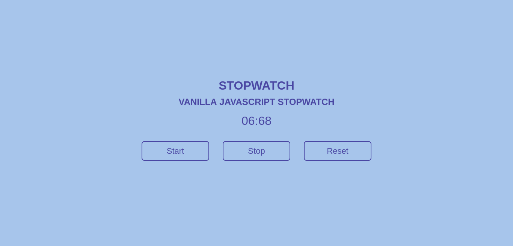

# Vanilla Javascript Stopwatch

## Apa yang saya pelajari?

- DOM Event Handling
- `setInterval` dan `clearInterval` untuk membuat dan menghapus looping

## Demo

[https://alfianokt.github.io/vanilla-javascript-projects/stopwatch](https://alfianokt.github.io/vanilla-javascript-projects/stopwatch/index.html)