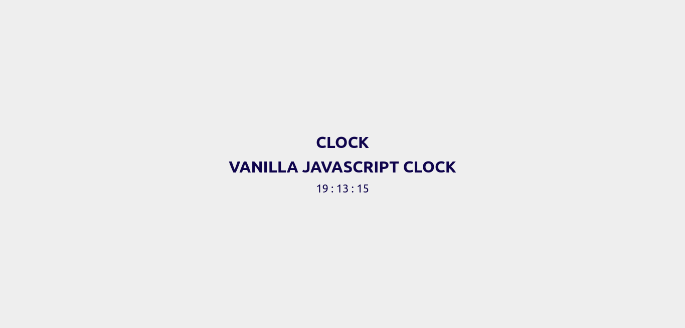

# Vanilla Javascript Clock

## Apa yang saya pelajari?

- Class Date untuk mendapatkan informasi waktu
- Rekursif fungsi
- `setInterval` untuk membuat looping

## Demo

[https://alfianokt.github.io/vanilla-javascript-projects/clock](https://alfianokt.github.io/vanilla-javascript-projects/clock/index.html)